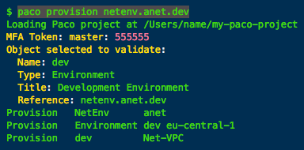
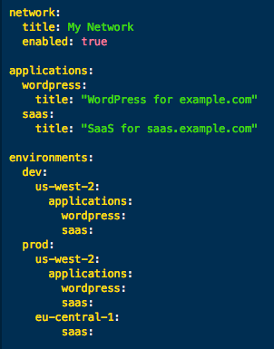

Paco: Prescribed automation for cloud orchestration
===================================================

|check| 100% automation of the creation and management of your cloud resources.

|check| Define your cloud with declarative YAML.

|check| Consistent semantic structure for all your cloud projects.

Automate your AWS cloud with an Infrastructure as Code project - without writing any code.
Paco includes all the code you need built-in to the tool, so you only need to create
declarative configuration to describe your cloud from at a high level.

.. image:: _static/images/clone-envs.png
   :class: paco-left

Turnkey AWS solutions, repeatable environments and DRY configuration
--------------------------------------------------------------------

|check| Complete turnkey solutions out-of-the box.

|check| Easily clone complete environments.

|check| Don't Repeat Yourself and override only the differences between environments.

Start with complete turnkey AWS solutions and customize to your needs. Begin with complete networks
with reference applications that include monitoring, alerting, centralized logging already configured.

Reproduce your development, staging and production environments exactly. DRY configuration allows you
to override just the differences between environments - easily see just what is different
in each environment.

Prescribed automation instead of repetitive coding
--------------------------------------------------

|check| Monitoring, alerting and centralized logging all built-in.

|check| Automatic secure mutli-account IAM user, policy and role management.

|check| EC2 Launch Manager configures EC2 instances easily and quickly.

Paco is an opinionated cloud orchestration tool that believes that routine,
boilerplate automation should be abstracted away by tooling. If you configure an S3 Bucket to
notify a Lambda function, why should you have to create a Lambda Permission by hand? Mounting an
EFS filesystem as easy as creating a Paco Reference for your AutoScalingGroup resource to an EFS resource.
List in-host metrics and logs and your EC2 instances will have a CloudWatch agent automatically
configured to collect them.

Declarative semantic configuration for your cloud
-------------------------------------------------

|check| Declarative configuration needed only.

|check| Semantic high-level concepts such as applications, environments, networks and accounts.

|check| Paco References allow you to describe your resources coupling without hard-coding.

|check| Resources tagged 100% consistently based on your semantic configuration.

Declarative configuration gives you predictability and repeatability in the automation of your cloud resources.
See configuration changes as a whole before you apply them to your cloud resources.

Install Paco and get started today
----------------------------------

Paco is free and open source with the `source code`_ on GitHub.

Get started by `installing`_ Paco and `connecting it to your AWS account`_.

.. _source code: https://github.com/waterbear-cloud/paco/

.. _installing: ./install.html

.. _connecting it to your AWS account: ./started.html

Paco community
--------------

Join us on reddit at `r/paco_cloud`_.

Ask us questions and chat with us on `paco-cloud on gitter`_.

Waterbear Cloud
---------------

PACO is developed by Waterbear Cloud. Contact us about our `support and consulting`_ professional services.

.. _paco-cloud on gitter: https://gitter.im/paco-cloud/community

.. _r/paco_cloud: https://www.reddit.com/r/paco_cloud/

.. _support and consulting: https://waterbear.cloud/contact/

.. toctree::
   :caption: Get Started with Paco
   :maxdepth: 3

   install
   started
   paco-home
   multiaccount
   paco-users

.. toctree::
   :caption: Command Line Interface
   :maxdepth: 3

   cli

.. toctree::
   :caption: Starter Projects
   :maxdepth: 3

   start-managed-webapp-cicd
   start-s3lambda

.. toctree::
   :caption: Paco project configuration
   :maxdepth: 3

   paco-config-basics
   paco-config

.. toctree::
   :caption: Copyright, Trademarks and Attributions
   :maxdepth: 1

   copyright

Indices and tables
------------------

* :ref:`glossary`
* :ref:`genindex`

.. add glossary in a hidden toc to avoid warnings

.. toctree::
   :hidden:

   glossary
