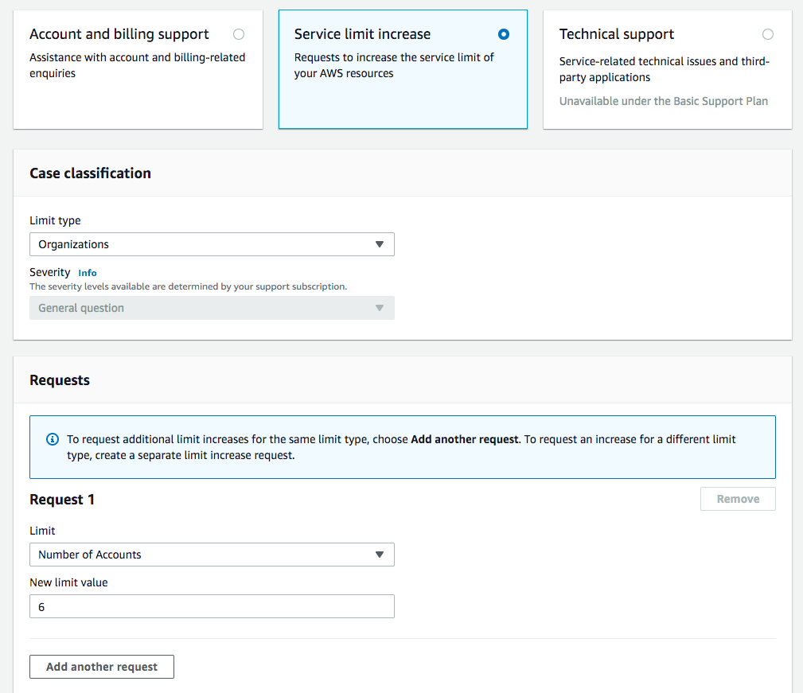
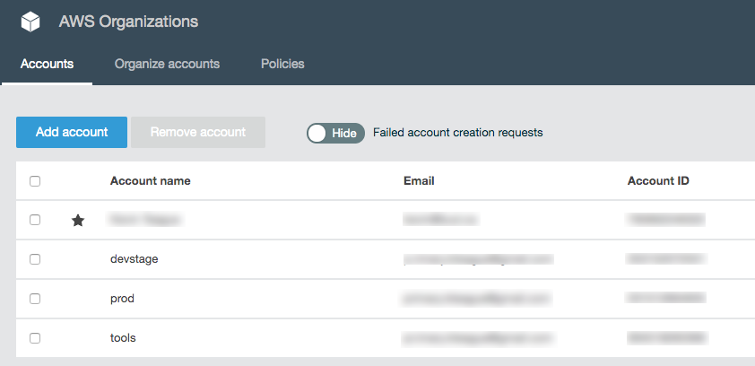

.. _multiaccount:

Multi-account Setup
===================

Paco can be run against a single AWS account or can be configured to control
multiple accounts. Having a multi-account configuration is recommended for more serious cloud
uses, for some of the benefits see `Why use a multi-account architecture on AWS?`_.

Enable AWS Organizations
------------------------

AWS has a service called `AWS Organizations`_ which lets you centrally govern your accounts. You
will have a master account where you create an organization and from there child accounts can be created.

To get started, login to the AWS Console with your AWS account as a user with Administrator access.
Assuming you only have one account - this will become your master account. This account will control
the child accounts and the billing for all the child accounts will be charged to the master account.

Go to the AWS Organizations page and click "Create Organization" to convert your AWS account into a master account.

.. image:: _static/images/new-organization.png

You will get an email from AWS to your root account email asking you to confirm your email address. Click on the link
in the email and you should see a message saying **Your email address has been verified. You can now invite existing
AWS accounts to join your organization.**

Do not create any of the child accounts from the console - we will let Paco create the accounts and it will
store the configuration for those accounts in your Paco project.

Plan your accounts and AWS account limits
-----------------------------------------

Take a minute to think about which AWS accounts you will want. A few common account suggestions and uses - although
these are only suggestions, you are encouraged to think about your own requirements and determine your own
multi-account structure:

 - master: This is the only required account, and Paco always refers to this account by the name 'master'.

 - prod: Having production resources in their own dedicated account is the most common reason to be multi-account.

 - staging: Resources for a pre-prod, test or staging environment.

 - dev: Resources for development environments.

 - test: If you anticipate a lot of non-production environments, or simply have environments which can be easily
   created and destroyed, you may want to put your development and staging environments in one account.

 - security: You may forward logging (especially CloudTrail) from all your accounts into a security account.

 - sharedservices: Expensive global resources that support all environments, such as ActiveDirectory, may go in
   a dedicated shared services account.

 - tools: For CI/CD and CodeCommit resources it can be useful to have a dedicated account that will have limited deploy
   capabilities to your dev/staging and prod accounts. Cross-account tooling

In your Paco project, the file ``accounts/master.yaml`` has a field named ``organization_account_ids`` which is for a list
of all the child accounts. Open this file and create a list of the child accounts you want to create initially.
If you later decide you want more accounts, you can simply add them here and follow the "Create child accounts with
Paco" section again.

.. code-block:: text

    file: accounts/master.yaml

    organization_account_ids:
    - prod
    - staging
    - dev
    - security
    - tools

Next in the planning is to think about email addresses. AWS requires that every child account has a unique email address associated
with it. These email addresses can be used to login as root to the child account, so ensure that whoever has access to the email addresses
is trusted with access to that account.

.. Note::

    If you are setting up a multi-account for a personal or smaller organization and are using gmail, you can insert . characters
    in the left-hand portion of an email to create email aliases. For example, ``examples@gmail.com`` and ``e.x.ample@gmail.com`` will
    both go to the same inbox.

Out of the gate, AWS limits you to **only four accounts** - including the master account. If you plan on using more
accounts than four accounts, you will need to contact AWS Support. In the upper-right corner of the console, choose Support and then
Support Center. On the Support Center page, choose Create case.

After you submit your account limit increase request it can take a few hours or a full day or more before your account is reviewed
and your limit is increased.

Create child accounts with Paco
-------------------------------

To create child accounts is a two-step process. First you will run ``paco init accounts`` which will create a YAML file for
every child account listed in ``organization_account_ids`` in the ``accounts/master.yaml`` file. The command is safe to run,
if you've already created some child accounts and those child account YAML files already exist they will simply be skipped over.

.. code-block:: text

    $ cd ~/my-paco-project
    $ paco init accounts

    Loading Paco project: /Users/home/my-paco-project

    AWS Account Initialization
    ---------------------------

    AWS Organization account names have already been defined: prod,devstage,tools

    Initializing Account Configuration: prod

    Title: [Production AWS Account]:
    Region: [us-west-2]:
    Root email address: you@example.com

Next you will actually create the child accounts. You will simply run ``paco provision`` with a scope of ``accounts`` to do this:

.. code-block:: text

    $ cd ~/my-paco-project
    $ paco provision accounts

When this finishes you should be able to go to the AWS Organizations service in the console for your master account and see your
child accounts:

Importing existing AWS accounts
-------------------------------

If you have existing AWS accounts, you can manually invite them to join your master account by using  the *Invitations* tab
in the AWS Organizations service in the console for the master account. The existing accounts will need confirmation from the
root email account associated with them, and then will join the master account.

Next you simply need to create an file in your Paco project's ``accounts`` directory where the filename is the name of account.

.. code-block:: text

    file: accounts/legacy.yaml

    account_type: AWS
    admin_delegate_role_name: Paco-Admin-Delegate-Role
    region: us-west-2
    title: Legacy AWS Account
    root_email: you@example.com
    account_id: '012345678912'

After you do this, run ``paco provision accounts`` in your Paco directory to update the IAM Role to allow it to delegate
access into your newly imported account.

.. _AWS Organizations: https://aws.amazon.com/organizations/

.. _Why use a multi-account architecture on AWS?: https://medium.com/waterbearcloud/why-use-a-multi-account-architecture-on-aws-bd63c871384

