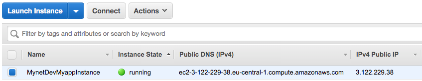
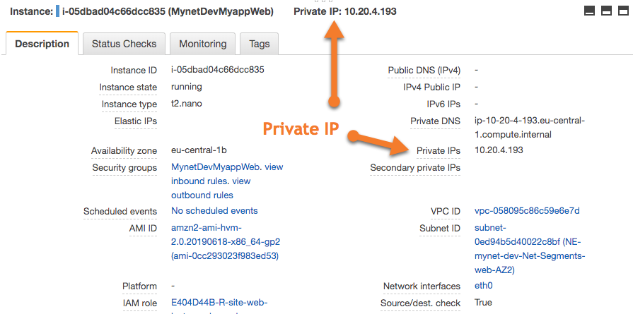

.. _quickstart102:

Quickstart Lab 102
==================

In the first quickstart, you learned how to create and provision an Paco project. You
will need the ``dev`` environment you provisioned at the end of Quickstart Lab 101 to
use as the starting point for this Quickstart Lab 102.

This quickstart will walk you through how to update an Paco project. You will add a new
EC2 instance and SecurityGroup, then you will deploy those updates to AWS. The EC2
instance will be launched in the public subnets, where a new SecurityGroup will
allow SSH access to the web servers in your private subnet.

    .. image:: _static/images/quickstart102-dev-bastion.png

Add bastion configuration
-------------------------

First, you will add a bastion to your Paco project. Open up the NetworkEnvrionments file
at ``./myproj/NetworkEnvironments/mynet.yaml``, and scroll down to the ``applications:`` section.

Then add the following ``bastion:`` YAML to the ResourceGroups for the myapp application. This is
at the YAML location ``applications:  myapp: groups``:

.. code-block:: yaml

  bastion:
    type: Bastion
    order: 2
    resources:
      instance:
        type: ASG
        order: 1
        enabled: true
        associate_public_ip_address: true
        cooldown_secs: 300
        desired_capacity: 1
        ebs_optimized: false
        health_check_grace_period_secs: 300
        health_check_type: EC2
        instance_iam_role:
          enabled: true
        instance_ami: paco.ref function.aws.ec2.ami.latest.amazon-linux-2
        instance_key_pair: pacokeypair
        instance_monitoring: false
        instance_type: t2.micro
        max_instances: 2
        min_instances: 1
        segment: public
        termination_policies:
          - Default
        update_policy_max_batch_size: 1
        update_policy_min_instances_in_service: 0
        security_groups:
          - paco.ref netenv.mynet.network.vpc.security_groups.myapp.bastion
        user_data_script: |
          #!/bin/bash
          yum update -y

.. Attention:: You need to get the indentation correct when you modify Paco YAML files,
  otherwise the configuration will attempt to be applied to the wrong types.

  If you have a text editor or IDE that does folding, you can collapse
  the sections to verify that your configuration has the correct indentation.
  You should see something like this:

  .. image:: _static/images/quickstart102-indent-folded.png

You will see that in the ASG resource you added that there is a reference to
a new security group:

.. code-block:: yaml

  security_groups:
    - paco.ref netenv.mynet.network.vpc.security_groups.myapp.bastion

This new ``bastion`` security group will allow SSH access from your IP address to
EC2 instances that belong to this security group. You will also modify the ``web``
security group to allow SSH access from instances that belong to the ``bastion``
security group.

Add the following block to the ``network: vpc: security_groups:`` section of your
``./myproj/NetworkEnvironments/mynet.yaml`` NetworkEnvironments file.
Make sure to change the ingress CIDR to your own IP address. If you wanted to
allowe multiple IP addresses access to the bastion, you can repeat the ingress
rule and just change the ``cidr_ip:`` field each time.

.. code-block:: yaml

  bastion:
    egress:
      - cidr_ip: 0.0.0.0/0
        name: ANY
        protocol: "-1"
    ingress:
      - from_port: 22
        name: SSH
        protocol: tcp
        cidr_ip: 128.255.128.255/32 # ToDo: change this to your IP address!
        to_port: 22

Then add the following the ingress rule to the ``web:`` security group:

.. code-block:: yaml

  - from_port: 22
    to_port: 22
    name: SSH
    protocol: tcp
    source_security_group: paco.ref netenv.mynet.network.vpc.security_groups.myapp.bastion

Your final network configuration should look like this:

.. code-block:: yaml

  network:

    title: "My Paco NetworkEnvironment"
    availability_zones: 2
    enabled: true
    region: eu-central-1
    vpc:
      enable_dns_hostnames: true
      enable_dns_support: true
      enable_internet_gateway: true
      nat_gateway:
        myapp:
          enabled: true
          availability_zone: 1
          segment: public
          default_route_segments:
            - web
      vpn_gateway:
        myapp:
          enabled: false
      private_hosted_zone:
        enabled: false
        name: example.internal
      security_groups:
        myapp:
          alb:
            egress:
              - cidr_ip: 0.0.0.0/0
                name: ANY
                protocol: "-1"
            ingress:
              - cidr_ip: 0.0.0.0/0
                from_port: 80
                name: HTTP
                protocol: tcp
                to_port: 80
          web:
            egress:
              - cidr_ip: 0.0.0.0/0
                name: ANY
                protocol: "-1"
            ingress:
              - from_port: 80
                name: HTTP
                protocol: tcp
                source_security_group: paco.ref netenv.mynet.network.vpc.security_groups.myapp.alb
                to_port: 80
              - from_port: 22
                to_port: 22
                name: SSH
                protocol: tcp
                source_security_group: paco.ref netenv.mynet.network.vpc.security_groups.myapp.bastion
          bastion:
            egress:
              - cidr_ip: 0.0.0.0/0
                name: ANY
                protocol: "-1"
            ingress:
              - from_port: 22
                name: SSH
                protocol: tcp
                cidr_ip: 70.68.173.245/32
                to_port: 22
      segments:
        public:
          enabled: true
        web:
          enabled: true

Run ``paco describe`` to validate that your new configuration changes can be properly parsed:

.. code-block:: text

  $ cd ~/projects # or where ever you put the Paco project directory
  $ paco describe --home myproj
  Project: myproj - My Paco Project
  Location: /Users/username/projects/myproj

  Accounts
  - master - Master AWS Account

  Network Environments
  - mynet - My Paco NetworkEnvironment

Provision the bastion
---------------------

After you change a Paco project, you can run ``paco provision`` and paco will detect
any changes to AWS resrouces and create new CloudFormation templates and update
existing ones as necessary.

.. code-block:: text

  $ paco provision --home myproj/ NetEnv mynet
  Provisioning Configuration: NetEnv.mynet
  MFA Token: master: 123456
  Network Environment
  NetEnv: mynet: Init: Starting
  Environment: dev
  Environment Init: Starting
  NetworkStackGroup Init: VPC
  NetworkStackGroup Init: Segments
  NetworkStackGroup Init: Security Groups
  NetworkStackGroup Init: NAT Gateway: myapp
  NetworkStackGroup Init: Completed
  ApplicationStackGroup: Init
  ApplicationStackGroup: Init: LBApplication: alb
  ApplicationStackGroup: Init: ASG: web
  ApplicationStackGroup: Init: ASG: instance
  ApplicationStackGroup: Init: Completed
  Environment Init: Complete
  Environment: prod
  Environment Init: Starting
  NetworkStackGroup Init: VPC
  NetworkStackGroup Init: Segments
  NetworkStackGroup Init: Security Groups
  NetworkStackGroup Init: NAT Gateway: myapp
  NetworkStackGroup Init: Completed
  ApplicationStackGroup: Init
  ApplicationStackGroup: Init: LBApplication: alb
  ApplicationStackGroup: Init: ASG: web
  ApplicationStackGroup: Init: ASG: instance
  ApplicationStackGroup: Init: Completed
  Environment Init: Complete
  NetEnv: mynet: Init: Complete
  master: Cached:  NE-mynet-dev-Net-VPC
  master: Cached:  NE-mynet-dev-Net-Segments-public
  master: Cached:  NE-mynet-dev-Net-Segments-web
  master: Update:  NE-mynet-dev-Net-SecurityGroups-myapp
  master: Cached:  NE-mynet-dev-Net-NGW-myapp
          Waiting: NE-mynet-dev-Net-SecurityGroups-myapp
          Done:    NE-mynet-dev-Net-SecurityGroups-myapp
  master: Cached:  NE-mynet-dev-App-myapp-euc1-IAM-Roles
  master: Cached:  NE-mynet-dev-App-myapp-ALB-site-alb
  master: Cached:  NE-mynet-dev-App-myapp-ASG-site-web
  master: Cached:  NE-mynet-dev-App-myapp-ASG-bastion-instance

After this you should be able to go to the EC2 Service in the AWS Console and see a
new EC2 instance running.

.. Attention:: If you are running against a real-world or production deployment,
  it is highly recommended to save your Paco project to version control before
  running ``paco provision``. If you take note of the version of Paco used to
  provision your configuration with ``paco --version``, you should always be
  able to use a version of your Paco project with the version of Paco to exactly
  recreate an AWS environment.

Test out your new instance
--------------------------

Take note of the IPv4 Public IP of the instance you launched. You can connect to
this instance over SSH. You will need the PEM file you generated from Quickstart 101
for this. Replace ``3.122.229.38`` with the IP address of your instance.

Note that as this bastion instance is in an autoscaling group, if there was underlying
hardware failure at AWS, a new instance would be spun up to replace it. However,
this new instance would have a new IP address. If you wanted to always have the
same IP address, you would need to create an Elastic IP (EIP) and attach that to
a newly launched instance in the bastion autoscaling group using UserData commands.

.. code-block:: bash

  $ ssh -i ~/path/to/pacokeypair.pem ec2-user@3.122.229.38

        __|  __|_  )
        _|  (     /   Amazon Linux 2 AMI
        ___|\___|___|

  https://aws.amazon.com/amazon-linux-2/
  7 package(s) needed for security, out of 13 available
  Run "sudo yum update" to apply all updates.

Now go back to the EC2 Service in the AWS Console and find the private IP address
of the web server:

Exit the bastion and copy your ``pacokeypair.pem`` file to the bastion so that it
can be used to connect to the private web servers.

.. code-block:: bash

  $ scp -i ~/path/to/pacokeypair.pem ~/path/to/pacokeypair.pem ec2-user@3.122.229.38

.. Attention:: Copying the public key to a bastion has security risks! If your bastion
  server was compromised, then an intruder would have access to all of your private servers.
  A more secure way to manage connections is to set-up a ``ProxyCommand`` in your ~/.ssh/config
  file. For example, with this the following configuration:

  .. code-block:: text

    Host aimbastion
    HostName 34.219.60.67
    User ec2-user
    IdentityFile ~/path/to/pacokeypair.pem

    Host 10.20.*
      IdentityFile  ~/path/to/pacokeypair.pem
      User ec2-user
      ProxyCommand ssh -W %h:%p  ec2-user@pacobastion

  You would be able run ``ssh 10.20.4.25`` and connect directly and securely to an instance in the
  private subnet at IP address 10.20.4.25.

Now from the bastion instance, SSH to the web server:

.. code-block:: bash

  [ec2-user@ip-10-20-2-46 ~]$ ssh -i pacokeypair.pem ec2-user@10.20.4.193

        __|  __|_  )
        _|  (     /   Amazon Linux 2 AMI
        ___|\___|___|

  https://aws.amazon.com/amazon-linux-2/

If you can connect, congratulations! From the instance you can
run ``sudo su`` to become root and view Apache error log files:

.. code-block:: bash

  [ec2-user@ip-10-20-4-193 ~]$ sudo su
  [root@ip-10-20-4-193 ec2-user]# less /var/log/httpd/error_log

In later quickstarts, we will show you how to add monitoring
and logging to your instances, so that you can use the AWS Console
to view everything you need to know about your instance and you
won't need to directly SSH to them to debug them.

Clean-up and next steps
-----------------------

When you are finished, remember to tear down all of your infrastructure
otherwise you will run up your AWS bill.

.. code-block:: bash

  $ paco delete --home myproj NetEnv mynet
  Proceed with deletion (y/N)? y
  Deleting: NetEnv.mynet
  Network Environment
  NetEnv: mynet: Init: Starting
  Environment: dev
  Environment Init: Starting
  NetworkStackGroup Init: VPC
  NetworkStackGroup Init: Segments
  NetworkStackGroup Init: Security Groups
  NetworkStackGroup Init: NAT Gateway: myapp
  NetworkStackGroup Init: Completed
  ApplicationStackGroup: Init
  ApplicationStackGroup: Init: LBApplication: alb
  ApplicationStackGroup: Init: ASG: web
  ApplicationStackGroup: Init: ASG: instance
  ApplicationStackGroup: Init: Completed
  Environment Init: Complete
  Environment: prod
  Environment Init: Starting
  NetworkStackGroup Init: VPC
  NetworkStackGroup Init: Segments
  NetworkStackGroup Init: Security Groups
  NetworkStackGroup Init: NAT Gateway: myapp
  NetworkStackGroup Init: Completed
  ApplicationStackGroup: Init
  ApplicationStackGroup: Init: LBApplication: alb
  ApplicationStackGroup: Init: ASG: web
  ApplicationStackGroup: Init: ASG: instance
  ApplicationStackGroup: Init: Completed
  Environment Init: Complete
  NetEnv: mynet: Init: Complete
  master: Delete:  NE-mynet-dev-App-myapp-ASG-bastion-instance
  master: Delete:  NE-mynet-dev-App-myapp-ASG-site-web
  master: Delete:  NE-mynet-dev-App-myapp-ALB-site-alb
          Waiting: NE-mynet-dev-App-myapp-ASG-bastion-instance
          Done:    NE-mynet-dev-App-myapp-ASG-bastion-instance
          Waiting: NE-mynet-dev-App-myapp-ASG-site-web

Future quickstarts are yet to be written. They will show you how
to add a CI/CD, monitoring, alerting and logging so that you can
rapidly deploy fully working, managed environments.
