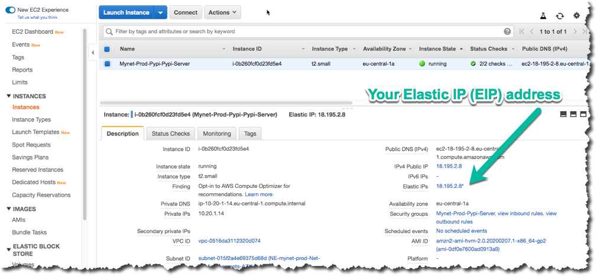
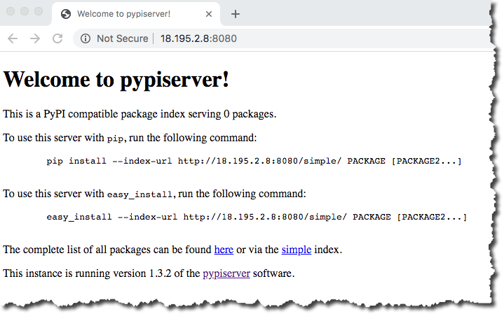

.. _start-privatepypi:

Private PyPI Server
===================

The **Private PyPI Server** creates a PyPI server for hosting your own Python Packages. The server can be
password protected to host private Python packages.

The Python packages are stored on an EFS filesystem mount. The PyPI server is hosted in an AutoScalingGroup
and will automatically relaunch and remount the EFS filesystem if the server is terminated. Configuration
is included which can be enabled to do routine back-ups on the EFS filesystem and monitor the PyPI server
and alert if the server is not responding.

The PyPI server can be run with two network configurations: "budget" and "professional". The first configuration
runs a simple single public network with the server directly serving requests to the internet with an ElasticIP.

The second configuration has public and private subnets with an an Application Load Balancer (ALB) in the public
subnet and a NAT Gateway to allow the web server(s) internet access. This increases the overall cost of the solution
but allows for more robust uptime and improved security. The Application Load Balancer is run in a separate
application named "shared". This configuration is designed to show you how a real-world AWS deployment might
run a single ALB and direct requests to a variety of backend resources.

Create a "Private PyPI Server" Project
--------------------------------------

`Install`_ Paco and then get started by running the ``paco init project <your-project-name>`` command.
Review the instructions on `Getting Started with Paco`_ to understand the importance of ``name``
fields in Paco and the difference between a name and title. Then follow the instructions on creating
credentials for your project to connect it to your AWS Account.

When asked "Budget - Lower cost but less robust set-up?" if you choose "Y" your configuration will
run a single server in a public subnet, if you choose "N" your configuration will have public/private
subnets and an Application Load Balancer and NAT Gateway. The latter configuration increases your
monthly costs by over $30 USD per month but allows you to run a fault tolerant cluster of servers.

Take a minute to `set-up a PACO_HOME environment variable`_, this will save you lots of time typing.

.. _Install: ./install.html

.. _Getting Started with Paco: ./started.html

.. _set-up a PACO_HOME environment variable: ./paco-home.html

Provision SNS Topics and EC2 Keypairs
-------------------------------------

If you want to configure monitoring and alerting to let you know when your PyPI server is having
potential problems, you will need to provision SNS Topics. The "admin" group group is configured to recieve
any alarm notifications. The project default is to use the same email as your root account, but you
can edit ``resource/snstopics.yaml`` and change this to whatever you want. See the `SNS Topics docs`_ for examples.

.. code-block:: bash

    paco provision resource.snstopics

Next, you will need to have an EC2 SSH Keypair in the same account and region as your PyPI deployment.
You can create a new keypair by running:

.. code-block:: bash

    paco provision resource.ec2.keypairs

Alternatively, you can edit ``resource/ec2.yaml`` and configure it to use an existing EC2 Keypair,
if you already have one created. See the `EC2 Key pairs`_ reference documentation for more information.

.. _SNS Topics docs: ./yaml-global-resources.html#sns-topics

.. _EC2 Key pairs: yaml-global-resources.html#ec2-keypairs

Provision the PyPI server resources
-----------------------------------

Now you are ready to provision the PyPI server. This will provision everything you need - VPC network, EFS filesystem,
AutoScalingGroup server(s). After this step, you should have a fully working PyPI server!

.. code-block:: bash

    paco provision netenv.mynet.prod

If you changed your NetworkEnvironment name, change the ``mynet`` string to that name. This starter project only contains
a single "prod" environment. However, Paco supports easily cloning environments, so you could provision a completely duplicate
"dev" or "test" environment if you did need a place to test new changes to your PyPI set-up without impacting your production
environment.

To visit your new PyPI server, if you are running the "budget" set-up, use the AWS Console to go to **EC2 --> Instances** and
click on your server. Find the Elastic IPs field:

Copy that IP into your web browser and your server will be running on port 8080, for example: http://255.255.255.255:8080

The PyPI server runs as a ``www-data`` user for security reasons. This user doesn't have permissions to bind to port 80,
so port 8080 is used instead.

If you are running the non-budget configuration, then you can go to **EC2 --> Load Balancers** in the AWS Console and
find the **DNS name** for your ALB. Put this name into your web browser and you should see your PyPI server:

Using and managing your PyPI server
-----------------------------------

The PyPI server is running the `pypiserver`_ application. The default configuration runs the PyPI server as a private package
server and requires authentication to download packages. It uses an ``htpasswd.txt`` file to contain the usernames and passwords
for the server.

You can customize your PyPI server if you want to make it public or use a different authentication method. Visit the `pypiserver`_ GitHub
page to see all of the option available for server configuration.

The PyPI server is started and configured automatically by SystemD when a new EC2 instance launches. The configuration management for
the server is done with AWS CloudFormationInit. You will see a file in your Paco project at ``netenv/pypi-config/pypiserver.service`` which
contains the PyPI server configuration. You can customize the configuration here, pay attention to the ``ExecStart=`` line which contains
all of the configuration options supplied to the PyPI server.

Take note that your packages are served from the directory ``/var/pypi/``. Paco has provided configuration to automatically mount this directory
to an EFS filesystem mount. The default configuration will also have created a ``/var/pypi/htpasswd.txt`` file which contains a starting username
and password of "uploader" and "Pass123...". This is a public example password, **you will want to change this file and replace it with private
usernames and passwords!**

You will have a file at ``netenv/pypi-config/htpasswd.txt`` which contains an Apache-style htpasswd file. You can run the ``htpasswd`` CLI to
add new usernames to this file:

.. code-block:: bash

    htpasswd -b ./netenv/pypi-config/htpasswd.txt newuser NewPassword123!

The contents of this file is embedded into the CloudFormation template used to provision the PyPI server AutoScalingGroup. You can
add and remove passwords locally and then run:

.. code-block:: bash

    paco provision -y netenv.mynet.prod

This will apply changes to the file to the CloudFormation stack. The PyPI server is configured to run ``cfn-hup`` to automatically
ping the CloudFormation service every 15 minutes and if new changes are detected, to automatically apply them to the PyPI server.

This is a simple and easy way to manage PyPI server passwords, but it does expose hashed passwords in both your Paco project (which
you will likely want to keep in a git repo) and through your AWS Console. These passwords could then be compromised through brute force.
If you want to run stricter security on your PyPI authentication, then change the authentication configuration and you can disable
cfn-hup in your ``netenv/mynet.yaml`` file:

.. code-block:: yaml

                      cfn-hup:
                        enabled: false
                        ensure_running: false

.. _pypiserver: https://github.com/pypiserver/pypiserver

Finally,

Paco project configuration
--------------------------

Paco project's are designed to be easily configurable. Let's look at some configuration changes you could make to your project.

SSH Access
^^^^^^^^^^

With the SSH keypair that you used to launch your PyPI server, you can SSH to your server. You may find this necessary if
you want to remove packages from your PyPI server, or if you are trying to change the pypiserver

.. code-block:: bash

    ssh -i ~/.ssh/my-keypair.pem ec2-user@<my-eip-address>

In the budget set-up, you can SSH directly to your server. You will see this configuration in your ``netenv/mynet.yaml`` file:

    - port: 22
      name: SSH
      protocol: tcp
      cidr_ip: 0.0.0.0/0 # change to your IP to improve security

Change the open to the world "cidr_ip: 0.0.0.0/0" string to your IP address (e.g. "cidr_ip: 120.90.255.120/32") and run
``paco provision netenv.mynet.prod`` to limit access to just your IP address.

With the ALB set-up, you will need to launch a bastion server to be able to SSH to your PyPI server. To enable the bastion
you will need to enable it's configuration in the ``environments.prod.applications`` section:

.. code-block:: yaml

  environments:
    prod:
      title: "Production Environment"
      ...
      applications:
        pypi:
          enabled: true
        bastion:
          enabled: true

And then run ``paco provision netenv.mynet.prod`` and the instance will be launched.

Application Load Balancer (ALB)
^^^^^^^^^^^^^^^^^^^^^^^^^^^^^^^

The non-budget set-up runs behind an `Application Load Balancer`_ (ALB). This ALB can be configured to serve requests for other
applications. In addition, you can conifgure it to connect to your Route 53 hosted zone for your domain and serve traffic over
HTTPS.

The default configuration listens on port 80 only, but you will see commented out configuration to instead listen on port 443.
In your ``netenv/mynet.yaml`` find this configuration under the "listeners:" field:

.. code-block:: yaml

    http:
      port: 80
      protocol: HTTP
      target_group: pypi
      rules:
        pypi_forward:
          enabled: true
          rule_type: forward
          host: 'pypi.example.com'
          target_group: pypi
          priority: 10

Remove this configuration and uncomment everything below it. Also uncomment the ``example_com_cert:`` section and change
it's configuration to match the domain name you will use with your ALB. Finally you can uncommned the ``dns:`` section
and Paco will take care of adding the ALB DNS name to your Route 53 Hosted Zone.

Later, if you add a second application behind your ALB, you might have configuration such as:

.. code-block:: yaml

  http:
    port: 80
    protocol: HTTP
    redirect:
      port: 443
      protocol: HTTPS
  https:
    port: 443
    protocol: HTTPS
    ssl_certificates:
      - paco.ref netenv.mynet.applications.pypi.groups.shared.resources.example_com_cert
    target_group: pypi
    rules:
      pypi_forward:
        enabled: true
        rule_type: forward
        host: 'pypi.example.com'
        target_group: pypi
        priority: 10
      apptwo_forward:
        enabled: true
        rule_type: forward
        host: 'apptwo.example.com'
        target_group: apptwo
        priority: 20

.. _Application Load Balancer: yaml-app-resources.html#lbapplication

Monitoring
^^^^^^^^^^

The ``netenv/mynet.yaml`` file starts with monitoring disabled:

.. code-block:: yaml

    # enable/disable web server monitoring
    groups:
      pypi:
        resources:
          server:
            monitoring:
              enabled: false # metrics are OFF
              alarm_sets:
                pypiserver:
    # enable/disable HTTP checks
    monitoring:
      enabled: false # health checks are OFF
      health_checks:
        external_ping:
          enabled: false # health checks are OFF

You can change the ``monitoring`` and ``external_ping`` sections to ``enabled: true`` and then run:

.. code-block:: bash

    paco provision netenv.mynet.prod

This will install a CloudWatch Agent to gather in-host metrics from the PyPI servers and enable a Route 53 Health Check
which will continually ping your server and alert you when it goes down.

There will also be CloudWatch Alarms created for StatusChecks, CPU, Swap and DiskSpace on the root volume.

Also be warned that enabling in-host metrics will change your AutoScalingGroup UserData which will cause new EC2 instance(s)
to be launched. In the default configuration this will cause a few minutes downtime for your PyPI server.

Enabling in-host metrics, health checks and alarms will increase your AWS bill by a few dollars a month.

Backups
^^^^^^^

Your PyPI packages live on an AWS EFS filesystem. This is a very robust and reliable filesystem, however you may still like to
maintain regular backups of this filesystem. In your ``netenv/mynet.yaml`` find this configuration:

.. code-block:: yaml

    backup_vaults:
      pypi:
        enabled: false # backups are off

And simply change it to ``enabled: true`` and run ``paco provision netenv.mynet.prod``.

You can review your backup configuration in the ``netenv/mynet.yaml`` file:

.. code-block:: yaml

  backup_vaults:
    pypi:
      enabled: false
      plans:
        ebs:
          title: EFS Backups
          enabled: true
          plan_rules:
            - title: Daily EFS backups
              schedule_expression: cron(0 6 ? * * *)
              lifecycle_delete_after_days: 365
          selections:
            - title: EFS Daily Backups Selection
              tags:
                - condition_type: STRINGEQUALS
                  condition_key: Paco-Application-Name
                  condition_value: pypi

This default configuration will do daily back-ups at 6 am every day, and keep backups for 365 days.

Questions?
----------

This is only a sample of what you can do with Paco to configure and run an application such as a PyPI server on AWS.
This documentation is far from exhaustive, so if you get stuck during installation or configuration, then you're welcome
to jump on the `paco-cloud Gitter community`_ and ask us questions.

.. _paco-cloud Gitter community: https://gitter.im/paco-cloud/community

