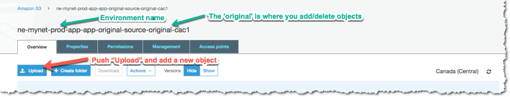
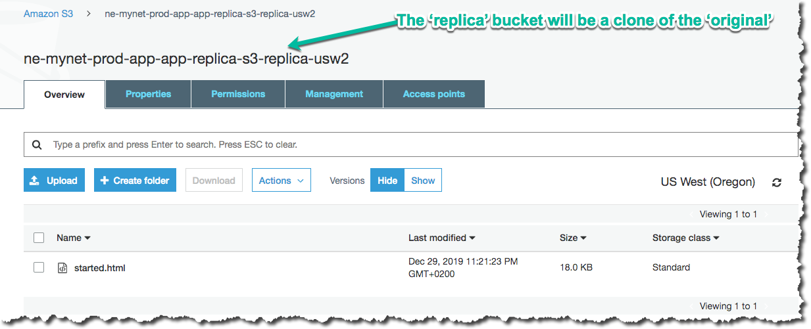
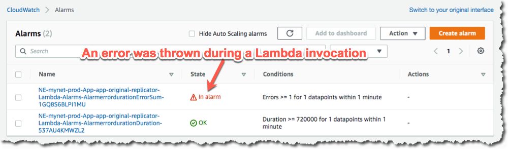

.. _start-s3lambda:

S3 Bucket Lambda replicator
===========================

The **S3 Bucket Lambda replicator** starter project creates an S3 Bucket which will invoke
a Lambda function with every object addition and deletion. The Lambda will copy or delete
the object from the source S3 Bucket to replica S3 Buckets in other regions.

S3 Buckets already have a Cross-Region replication (CRR) feature and we recommned you use this
feature for robust data replication. However, CRR only allows you to replicate to only a single
other region. It is also not possible to daisy-chain from the target S3 Bucket to another region.
This solution was originally developed for deploying Lambda artifacts to multiple regions.

It serves as an example of using Paco to manage S3 Bucket and Lambda objects. There is no
network or other complex resources in this starting project.

Create a "S3 Bucket Lambda replicator" Project
----------------------------------------------

`Install`_ Paco and then get started by running the ``paco init project <your-project-name>`` command.
Review the instructions on `Getting Started with Paco`_ to understand the importance of ``name``
fields in Paco and the difference between a name and title. Then follow the instructions on creating
credentials for your project to connect it to your AWS Account.

You will be asked to provide prompts for a NetworkEnvironment name and title. While this project
does not provision any network resources, Paco still uses the name ``netenv`` to refer to a
set of environments that contain the same set(s) of applications and shared resources.

Take a minute to `set-up a PACO_HOME environment variable`_, this will save you lots of time typing.

Customize and Provision SNS Topics
----------------------------------

You will need to create SNS Topics if you want to provision the prod environment,
which has CloudWatch Alarms to notify you if the Lambda function throws errors or
is taking too long to complete.

These SNS Topics contain SNS Subscriptions. Review the ``resource/snstopics.yaml`` file
and note that there is an **admin** group with one email subscription.

This group is configured to recieve any alarm notifications. You can add as many subscriptions
to this group as you want. See the `SNS Topics docs`_ for examples of all protocols.

.. _SNS Topics docs: ./yaml-global-resources.html#sns-topics

Customize and Provision Environments
------------------------------------

There are two environments with this project: dev and prod. They are almost the same
except the prod environment has a pair of CloudWatch Alarms to notify you if your Lambda
function has invocation problems.

Before you provision these environments, if you are using this netenv in a multi-account
set-up, review the ``aws_account`` field and change this to the correct account name you
want to use:

.. code-block:: yaml

  prod:
    title: "Production Environment"
    default:
      network:
        aws_account: paco.ref accounts.prod # deploy prod env to prod account

Now provision an environment with:

.. code-block:: bash

    paco provision netenv.mynet.dev
    paco provision netenv.mynet.prod

The prod environment is also intended to be used with more than one region to replicate into.
You will see this at the very bottom of your project's ``netenv/mynet.yaml`` file:

.. code-block:: yaml

    us-west-2:
      enabled: true
      applications:
        app:
          groups:
            replica:
              enabled: true

You can add as many regions here as you need:

.. code-block:: yaml

    us-west-2:
      enabled: true
      applications:
        app:
          groups:
            replica:
              enabled: true
    us-east-1:
      enabled: true
      applications:
        app:
          groups:
            replica:
              enabled: true
    ca-central-1:
      enabled: true
      applications:
        app:
          groups:
            replica:
              enabled: true

This will create the S3 Buckets to hold the replicated objects. You will also need to tell the Lambda
which buckets to replicate into using an environment variable named ``REGIONS``:

.. code-block:: yaml

    prod:
      ca-central-1:
        applications:
          app:
            groups:
              original:
                enabled: true
                resources:
                  replicator:
                    environment:
                      variables:
                        - key: 'ENV'
                          value: 'prod'
                        - key: 'REGIONS'
                          value: 'usw2;use1;cac1'

You will need to use the short region name for each AWS region. See the ``aws_regions`` section in
the `paco.models vocabulary file`_ to look-up the short names for regions. There will also be an S3 Bucket created
in the same region as the original bucket, if you need to replicate into that region with an S3 Bucket name that
is consistent with the other regions.

.. _paco.models vocabulary file: https://github.com/waterbear-cloud/paco.models/blob/master/src/paco/models/vocabulary.py

Finally, update your Paco ``project.yaml`` file to have a list of all of your ``active_regions``. This is a master lists
of regions you should be active in. It can be used in certain places in your configuration to list ``all`` as a special
keyword to refer to all your Paco project's useable regions:

.. code-block:: yaml

        name: myproj
        title: MyProj
        active_regions:
        - eu-central-1
        - us-west-2
        - us-east-1
        - ca-central-1

Test Your S3 Bucket Lambda
--------------------------

Log into the AWS Console and go to the S3 Bucket service. You will see buckets with names like this:

.. code-block:: yaml

    ne-mynet-prod-app-app-original-source-original-cac1
    ne-mynet-prod-app-app-replica-s3-replica-usw2

Go the "orginal" bucket and upload an object:

Then navigate to a "replica" bucket and you should see a copy of your object:

If you didn't and this is in the prod environment, a CloudWatch Alarm will fire after
the Lambda invocation failed. This will happen if your environment variable names are incorrect.
You can also go to your Lambda and generate a Test invocation with an empty event and this will
cause the Lambda to safely throw an error.

In the CloudWatch service you will see your "Errors" Alarm in an alarm state:

There are two alarms, one for invocation errors and a second for duration. If the Lambda
takes longer than 80% of the total allocated run time, this error will fire. With this simple
Lambda it is unlikely that you will ever see this alarm be triggered, but such an alarm is
generally useful for any Lambdas that you deploy. AWS will suddenly stop an Lambda which
reaaches it's maximum duration, so it's good to be notified before this happens.

Apply an S3 Bucket Policy
-------------------------

If you were to use this for a real-world solution, you would also need to determine
what kind of S3 Bucket Policy should protect your buckets. This project starts with
a simple policy that allows only the root account access to s3:GetObject API calls
on the replica buckets. Adjust this policy to suit your needs:

.. code-block:: yaml

      replica:
        type: Application
        title: "Replica S3 Bucket"
        order: 1
        enabled: false
        resources:
          s3:
            type: S3Bucket
            enabled: true
            order: 1
            bucket_name: 'replica'
            deletion_policy: 'delete'
            policy:
              - aws:
                  - 'arn:aws:iam::123456789012:root'
                effect: 'Allow'
                action:
                  - 's3:GetObject'
                resource_suffix:
                  - '/*'
                  - ''

After updating the policy YAML, you can run:

.. code-block:: bash

    paco provision -y netenv.mynet.dev
    paco provision -y netenv.mynet.prod

And watch Paco update the S3 Bucket policy for ALL of your replica buckets. Enjoy!

.. _Install: ./install.html

.. _Getting Started with Paco: ./started.html

.. _set-up a PACO_HOME environment variable: ./paco-home.html
